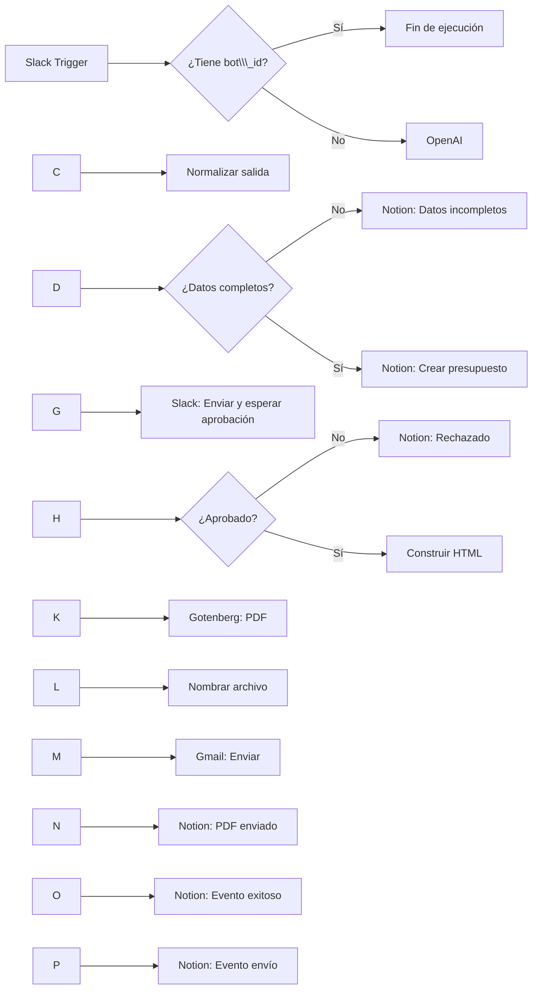

# Generador Inteligente de Presupuestos con Aprobación Humana

Automatización de extremo a extremo desarrollada en **n8n Self Hosted**. El flujo recibe una solicitud escrita en Slack, interpreta sus datos mediante OpenAI, registra el caso en Notion, espera una aprobación humana, construye un presupuesto en HTML, lo convierte a PDF con Gotenberg y lo envía por Gmail.

> Documento de implementación real (as-built). La fuente técnica principal es el workflow sanitizado `TP Final Generador Presupuestos.json`.

## Índice

* [Objetivo](#objetivo)
* [Alcance](#alcance)
* [Tecnologías](#tecnologías)
* [Arquitectura](#arquitectura)
* [Flujo funcional](#flujo-funcional)
* [Inventario de nodos](#inventario-de-nodos)
* [Contrato de datos](#contrato-de-datos)
* [Estados en Notion](#estados-en-notion)
* [Requisitos](#requisitos)
* [Instalación](#instalación)
* [Configuración](#configuración)
* [Credenciales](#credenciales)
* [Variables y valores configurables](#variables-y-valores-configurables)
* [Seguridad](#seguridad)
* [Pruebas](#pruebas)
* [Evidencias](#evidencias)
* [Limitaciones verificadas](#limitaciones-verificadas)
* [Notion](#notion)
* [Video](#video)
* [Documentación](#documentación)

## Objetivo

Reducir la intervención manual necesaria para preparar y enviar presupuestos, manteniendo un control humano obligatorio antes del envío al destinatario final.

El sistema resuelve estas tareas:

1. Recibe una solicitud desde un canal específico de Slack.
2. Descarta eventos generados por el propio bot.
3. Extrae concepto, período, importe y correo mediante OpenAI.
4. Detecta campos obligatorios faltantes.
5. Registra solicitudes completas o incompletas en Notion.
6. Solicita aprobación humana en Slack.
7. Genera un PDF únicamente cuando la solicitud fue aprobada.
8. Envía el documento por Gmail.
9. Actualiza el estado y registra eventos en Notion.

## Alcance

### Incluido

* Un único workflow de n8n.
* Entrada por Slack.
* Protección anti-bucle mediante `bot\\\_id`.
* Extracción estructurada con OpenAI.
* Moneda fija `ARS`.
* Campos obligatorios: concepto, período desde, período hasta, importe y email del destinatario.
* Registro de presupuestos en Notion.
* Registro separado de solicitudes incompletas.
* Aprobación humana con opciones `APROBAR` y `RECHAZAR`.
* Plantilla HTML/CSS embebida en un nodo Code.
* Conversión HTML a PDF mediante Gotenberg.
* Envío final por Gmail.
* Actualización del estado en Notion.
* Registro de eventos posteriores al envío.

### Fuera de alcance

* Múltiples niveles de aprobación.
* Cálculo de impuestos o retenciones.
* Varias monedas.
* Múltiples ítems por presupuesto.
* Firma digital.
* Facturación.
* Gestión integral de clientes.
* Reintentos exponenciales, colas, DLQ o circuit breakers.
* Recuperación técnica avanzada ante fallas de APIs.
* Detección de duplicados de negocio.

## Tecnologías

|Tecnología|Responsabilidad real|
|-|-|
|n8n Self Hosted|Orquestación, decisiones, transformación de datos y coordinación de integraciones.|
|Slack|Canal de entrada y punto de aprobación humana.|
|OpenAI|Extracción estructurada de datos desde lenguaje natural.|
|Notion|Memoria operativa, estados y eventos.|
|HTML/CSS|Plantilla del presupuesto.|
|Gotenberg|Conversión de HTML a PDF.|
|Gmail|Entrega del PDF al destinatario.|
|Docker|Ejecución de n8n y disponibilidad interna de Gotenberg.|
|GitHub|Publicación académica del JSON, PDFs y evidencias.|

## Arquitectura



### Decisión anti-bucle

El nodo `¿Es mensaje del Bot?` se encuentra inmediatamente después del trigger. La condición verifica la existencia de `bot\\\_id`:

* **TRUE:** el evento fue generado por el bot; la rama queda deliberadamente sin conexión y la ejecución termina.
* **FALSE:** el mensaje proviene de un usuario y continúa hacia OpenAI.

La rama TRUE sin conexión es una decisión de arquitectura. Evita que los mensajes de aprobación publicados por la integración vuelvan a iniciar el mismo proceso.

## Flujo funcional

### Camino feliz

1. El solicitante escribe un mensaje completo en Slack.
2. OpenAI devuelve un objeto estructurado.
3. n8n normaliza los datos y genera un identificador `PRE-AAAA-NNNNNN`.
4. Notion crea el presupuesto con estado `Pendiente de aprobación`.
5. Slack muestra una vista previa y espera una decisión humana.
6. El aprobador selecciona `APROBAR`.
7. El nodo Code valida los campos, escapa los valores dinámicos y crea `binary.html\\\_file`.
8. Gotenberg devuelve el PDF en la propiedad binaria `data`.
9. El PDF recibe un nombre dinámico.
10. Gmail envía el documento al correo extraído del mensaje.
11. Notion actualiza el estado a `PDF enviado` y registra los eventos finales.

### Datos incompletos

Cuando falta al menos uno de los campos obligatorios, la rama FALSE de `IF - ¿Datos Completos?` crea un registro en Notion con estado `Datos incompletos` y deja constancia de `Campos faltantes`. No se solicita aprobación y no se genera ningún PDF.

### Rechazo

Cuando la respuesta humana es negativa, `NOTION - Marcar Rechazado` actualiza el registro original. La ejecución termina sin construir HTML, sin generar PDF y sin enviar correo.

## Inventario de nodos

|ID|Nodo|Tipo / versión|Función|
|-|-|-|-|
|N-01|`Slack Trigger - Recibir solicitud`|`n8n-nodes-base.slackTrigger` v1|Recibe mensajes del canal de Slack configurado.|
|N-02|`¿Es mensaje del Bot?`|`n8n-nodes-base.if` v2.3|Detecta bot\_id. TRUE finaliza; FALSE continúa.|
|N-03|`IA - INTERPRETAR SOLICITUD`|`@n8n/n8n-nodes-langchain.openAi` v2.3|Extrae datos con gpt-4.1-mini y JSON Schema.|
|N-04|`Normalizar salida IA`|`n8n-nodes-base.set` v3.4|Mapea la respuesta, conserva metadatos y genera el ID.|
|N-05|`IF - ¿Datos Completos?`|`n8n-nodes-base.if` v2.3|Separa solicitudes completas de incompletas.|
|N-06|`NOTION - Crear Presupuesta Incompleto`|`n8n-nodes-base.notion` v2.2|Registra solicitudes con campos faltantes.|
|N-07|`NOTION - Crear Presupuesto`|`n8n-nodes-base.notion` v2.2|Crea el presupuesto con estado Pendiente de aprobación.|
|N-08|`SLACK - Solicitar Aprobación (human in the loop)`|`n8n-nodes-base.slack` v2.5|Envía vista previa y espera APROBAR/RECHAZAR hasta 5 minutos.|
|N-09|`IF - ¿Presupuesto aprobado?`|`n8n-nodes-base.if` v2.3|Evalúa data.approved como booleano estricto.|
|N-10|`NOTION - Marcar Rechazado`|`n8n-nodes-base.notion` v2.2|Actualiza el presupuesto a Rechazado.|
|N-11|`HTML - Construir Presupuesto`|`n8n-nodes-base.code` v2|Valida datos, escapa HTML y crea binary.html\_file.|
|N-12|`HTTP - Generar PDF`|`n8n-nodes-base.httpRequest` v4.4|Convierte el HTML con Gotenberg por HTTP multipart.|
|N-13|`CODE - Nombrar PDF`|`n8n-nodes-base.code` v2|Valida binary.data y asigna nombre/mime type.|
|N-14|`GMAIL - Enviar Presupuesto`|`n8n-nodes-base.gmail` v2.2|Envía el PDF al email extraído de la solicitud.|
|N-15|`NOTION - Marcar PDF Enviado`|`n8n-nodes-base.notion` v2.2|Actualiza el estado a PDF enviado.|
|N-16|`NOTION - Registrar Evento Exitoso`|`n8n-nodes-base.notion` v2.2|Crea un evento de procesamiento exitoso.|
|N-17|`NOTION - Registrar Evento Envío`|`n8n-nodes-base.notion` v2.2|Crea el evento final de envío con la configuración visible en el JSON.|


> El nombre técnico `NOTION - Crear Presupuesta Incompleto` se conserva exactamente como aparece en el JSON final, aunque contiene una diferencia gramatical.

## Contrato de datos

### Entrada de Slack

Campos utilizados por el workflow:

|Campo|Uso|
|-|-|
|`text`|Mensaje que se envía a OpenAI.|
|`user`|Identificador del solicitante.|
|`channel`|Canal de origen y destino de la aprobación.|
|`thread\\\_ts` / `ts`|Referencia del hilo o mensaje original; se conserva en la normalización.|
|`bot\\\_id`|Detección de mensajes automáticos.|

### Salida estructurada de OpenAI

```json
{
  "concepto": "string | null",
  "periodo\\\_desde": "string | null",
  "periodo\\\_hasta": "string | null",
  "importe": "number | null",
  "moneda": "ARS",
  "email\\\_destinatario": "string | null",
  "datos\\\_completos": true,
  "campos\\\_faltantes": \\\[]
}
```

El JSON Schema exige los ocho campos, impide propiedades adicionales y limita `moneda` a `ARS`.

### Datos normalizados

Además de los campos de IA, el nodo `Normalizar salida IA` agrega:

* `mensaje\\\_original`
* `usuario\\\_slack`
* `channel\\\_id`
* `thread\\\_ts`
* `presupuesto\\\_id`
* `fecha\\\_solicitud`

El identificador se genera con esta regla:

```javascript
"PRE-" + $now.format("yyyy") + "-" + String($execution.id).padStart(6, "0")
```

### Binarios

|Etapa|Propiedad|Contenido|
|-|-|-|
|HTML|`binary.html\\\_file`|Archivo `index.html` codificado en base64.|
|Respuesta Gotenberg|`binary.data`|PDF generado.|
|Renombrado|`binary.data.fileName`|`Presupuesto\\\_PRE-AAAA-NNNNNN.pdf`.|

## Estados en Notion

El flujo final utiliza estos estados verificables:

|Estado|Momento|
|-|-|
|`Datos incompletos`|Solicitud con uno o más campos obligatorios ausentes.|
|`Pendiente de aprobación`|Presupuesto completo creado antes del HITL.|
|`Rechazado`|Decisión humana negativa.|
|`PDF enviado`|Gmail finalizó y se actualizó el registro.|

No existe una actualización intermedia a `Aprobado` o `Generando PDF` en el JSON final.

## Requisitos

* Instancia n8n Self Hosted accesible y operativa.
* Slack App conectada al workspace y al canal elegido.
* Credencial de OpenAI válida.
* Integración de Notion con acceso a las bases `Presupuestos` y `Eventos`.
* Gotenberg accesible desde n8n en `http://gotenberg:3000` o endpoint equivalente configurado.
* Credencial Gmail OAuth2.
* HTTPS y URL pública válidos para los webhooks y callbacks que lo requieran.
* Propiedades de Notion con nombres y tipos compatibles con el workflow.

## Instalación

1. Importe `workflow/TP Final Generador Presupuestos.json` en n8n.
2. Asocie las credenciales de Slack, OpenAI, Notion y Gmail desde la interfaz de n8n.
3. Sustituya los valores sanitizados indicados en [Variables y valores configurables](#variables-y-valores-configurables).
4. Verifique que Gotenberg comparta red con n8n o cambie la URL del nodo HTTP.
5. Revise los nombres y tipos de propiedades de Notion.
6. Ejecute las pruebas funcionales antes de activar el workflow.
7. Active el workflow. El JSON sanitizado se exportó con `active: false`.

## Configuración

### Slack

* Evento del trigger: `message`.
* Canal: valor sanitizado `REEMPLAZAR\\\_CHANNEL\\\_ID\\\_SLACK`.
* El trigger queda acotado al canal configurado.
* La aprobación utiliza `sendAndWait` con dos opciones.
* Etiquetas: `APROBAR` y `RECHAZAR`.
* Tiempo máximo configurado: 5 minutos.

### OpenAI

* Modelo configurado: `gpt-4.1-mini`.
* Temperatura: `0`.
* Máximo de tokens: `300`.
* Formato: `json\\\_schema`.
* Entrada dinámica: `{{ $json.text }}`.

### Notion

Bases utilizadas:

* `Presupuestos`: ID, fecha, mensaje, concepto, períodos, importe, moneda, email, usuario Slack, canal, hilo, estado y campos faltantes.
* `Eventos`: evento, fecha, tipo, resultado y descripción, según las propiedades visibles en los nodos finales.

### Gotenberg

* Método: `POST`.
* Endpoint del workflow: `http://gotenberg:3000/forms/chromium/convert/html`.
* Contenido: `multipart/form-data`.
* Campo binario enviado: `html\\\_file` con nombre de formulario `files`.
* Respuesta esperada: archivo.

### Gmail

* Destinatario: `email\\\_destinatario`.
* Asunto: `Presupuesto {presupuesto\\\_id}`.
* Mensaje HTML con número, concepto, período e importe.
* Adjunto: PDF binario generado en la etapa anterior.

## Credenciales

|Integración|Credencial necesaria|Observación|
|-|-|-|
|Slack Trigger|Slack API / OAuth2|Debe poder leer mensajes del canal configurado.|
|Slack Approval|Slack OAuth2|Debe poder publicar y esperar la respuesta de aprobación.|
|OpenAI|API credential|No se incluye en el JSON.|
|Notion|Internal Integration / API credential|Las bases deben compartirse con la integración.|
|Gmail|Gmail OAuth2|Requiere callback autorizado y consentimiento configurado.|

Nunca incorpore tokens, secretos o IDs de credenciales dentro del JSON del repositorio.

## Variables y valores configurables

Valores sanitizados que deben sustituirse después de importar:

```text
REEMPLAZAR\\\_CHANNEL\\\_ID\\\_SLACK
REEMPLAZAR\\\_DATABASE\\\_ID\\\_PRESUPUESTOS
REEMPLAZAR\\\_DATABASE\\\_ID\\\_EVENTOS
```

También deben verificarse:

* Endpoint interno de Gotenberg.
* Credenciales asociadas a cada nodo.
* Disponibilidad del modelo configurado en la credencial de OpenAI.
* Datos institucionales fijos de la plantilla HTML.
* Enlace público de Notion.
* Enlace del video demostrativo.

## Seguridad

Controles implementados:

* **Anti-bucle:** descarte de eventos con `bot\\\_id`.
* **Prompt Injection:** el System Prompt trata el mensaje como dato no confiable e ignora instrucciones del usuario.
* **Salida estricta:** JSON Schema con `additionalProperties: false`.
* **Costo controlado:** temperatura 0 y máximo de 300 tokens.
* **No invención:** los datos inciertos se devuelven como `null`.
* **Escape HTML:** el presupuesto escapa `\\\&`, `<`, `>`, comillas y apóstrofes.
* **Validación previa al PDF:** campos obligatorios e importe mayor que cero.
* **Credenciales fuera del JSON:** la exportación no contiene secretos ni referencias a IDs de credenciales.
* **Valores dinámicos:** destinatario, asunto, contenido, identificador y nombre de archivo se construyen durante la ejecución.

Riesgos residuales documentados:

* El correo y el contenido de la solicitud son enviados al proveedor de IA.
* No existe autenticación adicional del solicitante más allá del canal configurado.
* La aprobación se dirige al canal; el JSON conserva `thread\\\_ts`, pero no muestra su aplicación explícita en el nodo de aprobación.
* No existe una ruta técnica dedicada para caídas de APIs o vencimiento del tiempo de aprobación.

## Pruebas

La documentación final reconoce únicamente las pruebas reales informadas y ejecutadas durante la construcción:

|ID|Caso|Resultado esperado|Estado|
|-|-|-|-|
|CP-01|Camino feliz|PDF generado, enviado por Gmail y estado actualizado.|Aprobado|
|CP-02|Datos incompletos|Registro en Notion; sin aprobación, PDF ni correo.|Aprobado|
|CP-03|Rechazo humano|Estado Rechazado; sin PDF ni correo.|Aprobado|
|CP-04|Importe alternativo|Normalización de formatos como `$150.000` o `150 mil`.|Aprobado|
|CP-05|Prompt Injection|La IA mantiene el esquema y no cambia su función.|Aprobado|
|CP-06|Mensaje del bot|La rama TRUE finaliza y no se produce un nuevo ciclo.|Aprobado|

No se declaran como ejecutadas pruebas de fallas de API, timeouts externos, 429, 500, colas o reintentos.

## Evidencias

Estructura sugerida del repositorio:

```text
/
├── README.md
├── docs/
│   ├── Documentacion-Completa.pdf
│   └── Arquitectura.pdf
├── workflow/
│   └── TP Final Generador Presupuestos.json
└── evidencias/
    ├── 01-workflow-completo.png
    ├── 02-camino-feliz.png
    ├── 03-datos-incompletos.png
    ├── 04-rechazo.png
    ├── 05-importe-alternativo.png
    ├── 06-prompt-injection.png
    ├── 07-proteccion-antibucle.png
    ├── 08-notion-presupuestos.png
    ├── 09-notion-eventos.png
    └── 10-pdf-y-gmail.png
```

Antes de publicar, las capturas deben ocultar tokens, API keys, credenciales, direcciones privadas y datos personales innecesarios.

## Limitaciones verificadas

* La solución está orientada a un caso simple y a una única moneda.
* La plantilla contiene datos institucionales y condiciones fijas.
* No existe clasificación separada para mensajes que no sean presupuestos; un mensaje sin datos suficientes ingresa en la ruta de incompletos.
* La validación del formato `MM/AAAA` depende principalmente del prompt; no hay una validación regex posterior visible.
* El email no tiene una validación sintáctica adicional dentro del workflow.
* El flujo no consulta Notion antes de la IA; Notion funciona como memoria y registro posterior.
* No existe control de duplicados ni clave idempotente de negocio.
* No existe un estado intermedio `Aprobado`; el estado pasa de `Pendiente de aprobación` a `PDF enviado` si la ruta finaliza.
* No existe una ruta explícita de recuperación para errores de Slack, OpenAI, Notion, Gotenberg o Gmail.
* El nodo `IF - ¿Datos Completos?` conserva una comparación vacía residual en el JSON sanitizado; la regla funcional relevante es el booleano `datos\\\_completos`.
* El JSON no muestra el mapeo de una relación entre las bases de Notion. La relación debe demostrarse mediante evidencia de la base, si existe.
* La configuración visible de `NOTION - Registrar Evento Envío` es parcial; no se atribuyen campos no verificables.

## Notion

**Enlace de lectura:** https://app.notion.com/p/3a8411c1bdbe80fa8789fc80907d99a9?v=3a8411c1bdbe807996cc000c5c5c9e41


https://app.notion.com/p/3a8411c1bdbe80fa8789fc80907d99a9?v=3a8411c1bdbe807996cc000c5c5c9e41\&source=copy\_link


## Video

**Video demostrativo (3 minutos):** https://youtu.be/-DDlyv9dOqg

Secuencia mínima:

1. Mostrar el diagrama.
2. Enviar una solicitud completa en Slack.
3. Mostrar la salida estructurada de OpenAI.
4. Mostrar el registro en Notion.
5. Aprobar desde Slack.
6. Mostrar la generación y el envío del PDF.
7. Mostrar una prueba de datos incompletos o rechazo.
8. Confirmar que las credenciales permanecen ocultas.

## Documentación

* [Documentación completa](docs/Documentacion-Completa.pdf)
* [Arquitectura](docs/Arquitectura.pdf)
* [Workflow n8n sanitizado](workflow/TP%20Final%20Generador%20Presupuestos.json)

## Fuente de verdad y trazabilidad

Orden de precedencia utilizado para documentar el proyecto:

1. JSON final sanitizado del workflow.
2. Captura final del canvas de n8n.
3. Pruebas reales confirmadas por el responsable del proyecto.
4. Consigna académica.
5. Documentos preliminares, solo como contexto histórico.

Las diferencias entre el diseño preliminar y la implementación final se resolvieron siempre a favor del JSON real. La salida final es Gmail, el contrato incluye `email\\\_destinatario`, el workflow tiene 17 nodos y los estados efectivos son los indicados en este README.

